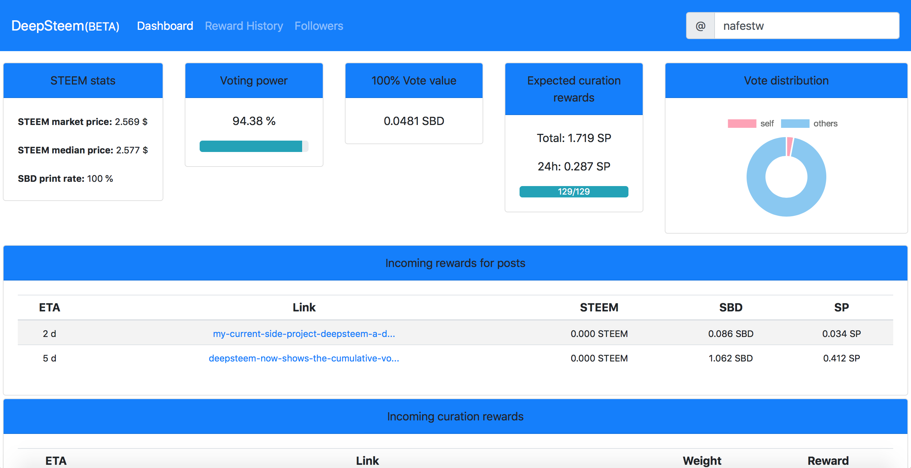

# DeepSteem - a DashBoard for the STEEM blockchain

DeepSteem is a DashBoard for the STEEM blockchain which shows several statistics for an account. It is written a standalone Angular application that requires no backend. A live version runs on http://deepsteem.com.

## Run DeepSteem locally

Clone the repository with `git clone https://github.com/nafest/deepsteem.git` and install all dependencies with `npm install`. Then, run `ng serve` for a dev server. Navigate to `http://localhost:4200/`. The app will automatically reload if you change any of the source files.

## Configuration

The default account name and whether a link to the last post of this account is displayed, can be configured in `src/app/config.ts`.

## Current features

At the present state, DeepSteem has the following features (amongst others):
* Computation of vote power and vote value
* Estimation of incoming curation rewards
* Estimation of incoming author rewards for posts
* Graph showing the amount of self-votes
* List of followers with cumulated vote value of all followers

# About Us
What Is Deep Steem?
DeepSteem is a dashboard for the STEEM blockchain written as frontend only Angular application.It is a small steem dashboard which was created by @nafestw. It is built on the steem blockchain where it gets its data from.

### How It Works
To use deepsteem, log on to http://deepsteem.com/#/dashboard where you input your steemit username and it brings out your data like vp, curation rewards, followers, history etc

### Features

* Estimation of incoming curation rewards

* Accurate estimation of incoming author rewards

* Cumulative voting power of all followers

* Computation of vote power and vote value

* Estimation of incoming author rewards for posts

* Graph showing the amount of self-votes

* List of followers with cumulated vote value of all followers

### More About Deepsteem
DeepSteem is implemented as frontend only Angular application (this way it can be run locally very easily). It uses steemjs to retrieve data from the STEEM blockchain. ng2-charts is used to display the diagram showing the share of self-votes. The current STEEM price is retrieved from https://coinmarketcap.com, using their REST API. Bootstrap is used for styling the frontend.

We at Deepsteem want our users to enjoy more features in the future. Presently we are looking forward to
Displaying of a diagram of the price feed
and

Classification of followers into active/inactive

Overhaul of the interface (especially visually)

For questions and suggestions please contribute on [GitHub](https://github.com/nafest/deepsteem)

# FAQ

What is Deepsteem?
DeepSteem is a dashboard for the STEEM blockchain written as frontend only Angular application.It is a small steem dashboard which was created by @nafestw. It is built on the steem blockchain where it gets its data from.

How does DeepSteem get the current value of steem?
The current STEEM price is retrieved from https://coinmarketcap.com, using their REST API.

Do i need to log in to DeepSteem with my steemit password before i can access my profile?
No, you do not need to log in with your steemit password. All you need is your username.

What are my benefits when i use DeepSteem
With DeepSteem you can get:

Estimation of incoming curation rewards

Accurate estimation of incoming author rewards

Cumulative voting power of all followers etc

What is followers cumulative voting value?
Followers cumulative value means the tota amount of vote woth all your followers will give when they vote you

Can I post using Deepsteem?
That feature is not available on Deepsteem?

Can i contribute or report a bug on DeepSteem?
If you want to fix bugs or add a feature to DeepSteem, open a pull request on [Github](https://github.com/nafest/deepsteem)

For questions and suggestions please contribute or ask on [GITHUB](https://github.com/nafest/deepsteem)
